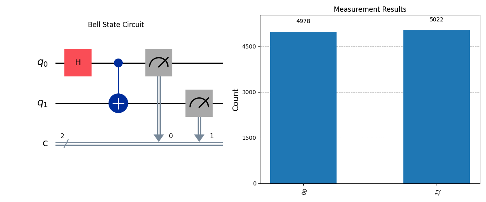

# Quantum Entanglement Visualizer

**Bell State** (Maksimal Entanglement) simulyatsiyasi — Qiskit kutubxonasi yordamida.

## Loyiha haqida
Bu loyiha ikkita qubit o‘rtasidagi quantum entanglement hodisasini ko‘rsatadi. Einsteinning "spooky action at a distance" deb atagan mashhur Bell holatini Python va Qiskit bilan modellashtiradi.

### Asosiy xususiyatlar
- Bell State (|00⟩ + |11⟩)/√2 yaratish
- Quantum circuit diagrammasi
- Measurement natijalari (histogram)
- Bloch sphere vizualizatsiyasi

## Natijalar


## Qanday ishlatish

```bash
# 1. Kutubxonalarni o'rnatish
pip install qiskit qiskit-aer matplotlib

# 2. Loyihani ishga tushirish
python bell_state.py
